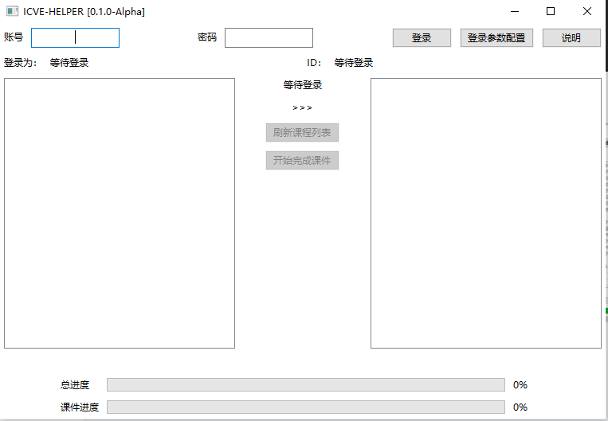

# ICVE-HELPER

## 当前版本
**0.1.0-Alpha**

## 使用说明
输入你的职教云账号和密码，点击登录按钮，登录成功后，你会看到你的名字和ID显示在输入框下方。

此时你可以根据提示，点击刷新课程按钮获取所有开课课程。

在左边课程列表中点击一个课程条目，会自动获取该课程下的所有课件

成功获取到一个课程的所有课件后，方可点击 开始完成课件 按钮开始完成所有课件

