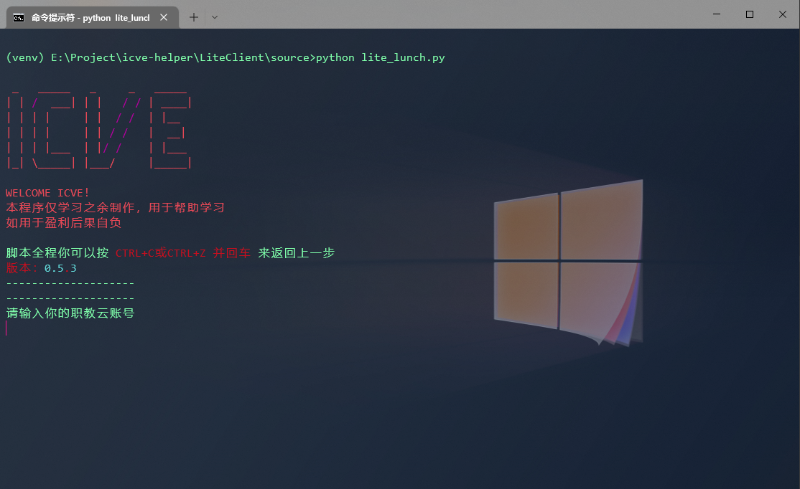
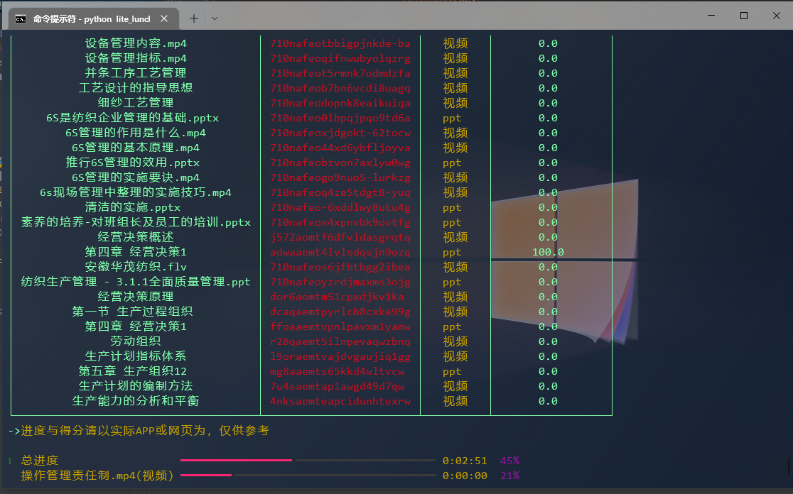

# 关于Lite
基于 [core/core.py](../core/core.py) 包装的可直接使用的ICVE-HELPER终端程序




## 更新说明
0.6.0
- 基于全新重构的 [core.py](../core/core.py) 脚本打造
- 评论功能现已可用

## 直接运行
打包后的EXE文件被保存在dist目录下，直接双击打开即可运行

## 源码
源码被包含在`source`目录中，启动文件为`lite_launch.py`
在启动或打包前，请务必安装以下两个三方库：
```
rich
requests
```
安装完毕后即可通过`python lite_launch.py`启动

如果需要打包，还需要安装`pyinstaller`，随后便可使用以下指令打包生成（推荐管理员模式）：
```shell
pyinstaller -F lite_launch.py -n ICVE-HELPER
```
