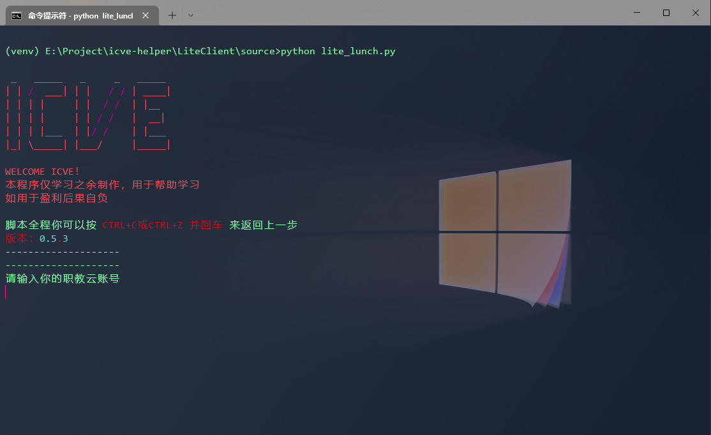
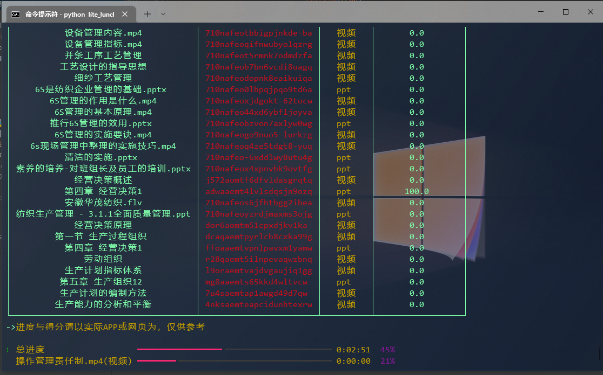
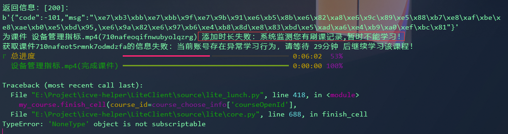

# ICVE-HELPER
## 如果有任何地方侵犯了您的权益，请在issue留言，我会及时处理、删除。

## INTRO
**目前不定时更新**

**最新更新**
- 针对 子节点 类型更新，直接获取子节点下所有课件
- 报错同时也返回服务器的响应内容，便于排查

**已打包好一份EXE文件可直接运行，详见`LiteClient`下的`README.md`**

**你可以自由地使用或修改本项目代码**

**发生报错请看本文档最后说明**

此仓库代码仅由本人出于学习研究所写，发布目的为学习交流，其中包含的第三方API等均为通过网络调试工具获取到的公共开放API，本人没有通过任何反编译等破解手段获取。
同时关于登陆处的加密代码来自互联网上他人公开的代码片段。
禁止任何人用于商业用途，后果自负。

代码都为大一至大二期间自学、研究学习所积累而成，因此代码可能会有很多繁琐复杂的"屎山"，以及幼稚的写法等，请见谅。

由于目前学业繁重，加上我这个野路子，是时候学习和转成"正规军"了（跑去学基础理论加C和单片机玩去了），所以现在这个仓库基本处于缓慢更新甚至停更的状态，如果有想法自行编写、维护吧。
其实ICVE这个APP并不难，非常适合作为新手练习对象（毕竟我就是这么学过来的） ~~但可不要把自己学进去了，违法的事咱别干~~

## 涵盖的功能
目前涵盖了登陆、退出等功能，以及课堂、课程、课件相关的功能。这些功能基本封装在`core`中，你可以参考lite对其调用，以此实现自动签到，自动评论，自动完成课件等等功能，可直接调用或自行再开发。

**MOOC学院相关功能暂时没有更新加入**

## 关于文档
在`docs`目录，包含了我在学习过程中对ICVE API的研究、记录与见解，可供参考，也欢迎补充。

## 关于所谓的Lite
帮助你更"好"地学习课件，你懂的。

如何启动？
请自行百度如何启动python脚本。
需要的三方库为：`rich` & `requests`，你可以使用以下指令安装：
`pip install rich requests -i https://pypi.tuna.tsinghua.edu.cn/simple`
（注意你的pip指令是`pip`还是`pip3`）

或者直接运行`dist/ICVE-HELPER.exe`文件，详见`LiteClient`下的`README.md`

**本人承若未使用该脚本以及该仓库下的所有代码进行过盈利活动**

## 报错？
### 为什么时不时报错？
不定时抽风，关闭脚本重新开始即可，直到全部刷完。

### 被检测到刷课了，怎么办？
如下所示：

可能是由于课件完成过快导致，耐心等待20到30分钟即可。

### 为什么这么慢？
本脚本原理为模拟并提交学习进度，例如视频，一次性会增加约18-19秒，同时为了防止被检测，会阻塞程序使其等待5-10秒的时间，这便会拉慢整体的速度，实属无奈之举...

### 为什么有些课件就是容易报错？
可以多试几次（甚至可以隔天再试），如果多试几次还是不行，那我也没辙，有些课件就是那么邪门...